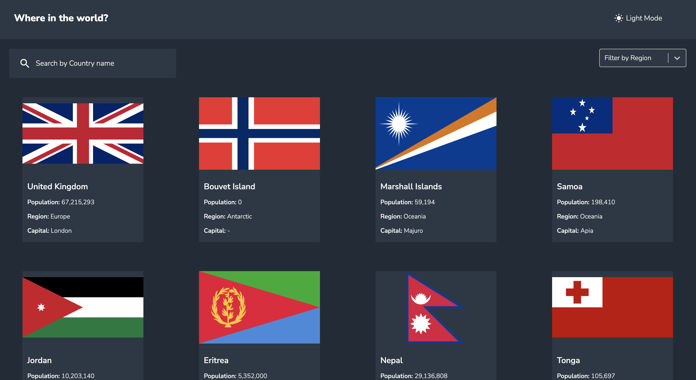

# Frontend Mentor - REST Countries API with color theme switcher solution

This is a solution to the [REST Countries API with color theme switcher challenge on Frontend Mentor](https://www.frontendmentor.io/challenges/rest-countries-api-with-color-theme-switcher-5cacc469fec04111f7b848ca). Frontend Mentor challenges help you improve your coding skills by building realistic projects. 

## Table of contents

- [Frontend Mentor - REST Countries API with color theme switcher solution](#frontend-mentor---rest-countries-api-with-color-theme-switcher-solution)
  - [Table of contents](#table-of-contents)
  - [Overview](#overview)
    - [The challenge](#the-challenge)
    - [Screenshot](#screenshot)
    - [Links](#links)
  - [My process](#my-process)
    - [Built with](#built-with)
    - [What I learned](#what-i-learned)
    - [Continued development](#continued-development)
  - [Author](#author)
  - [Acknowledgments](#acknowledgments)

## Overview

### The challenge

Users should be able to:

- See all countries from the API on the homepage
- Search for a country using an `input` field
- Filter countries by region
- Click on a country to see more detailed information on a separate page
- Click through to the border countries on the detail page
- Toggle the color scheme between light and dark mode *(optional)*

### Screenshot

### Links

- Solution URL: [Add solution URL here](https://your-solution-url.com)
- Live Site URL: [Add live site URL here](https://your-live-site-url.com)

## My process

### Built with

- React.js, React-Router (see note), Context
- vite.js for scaffolding the project and bundling
- Styling
  - CSS, SASS
  - Flexbox
  - CSS Grid
  - icons from [Material UI](http:www.mui.com) 
- important libraries
  - react-select

note: React-Router is used but it was not out of necessity, but mainly to learn about it. However in future, an additional route will be added. 

### What I learned

important new skills I learned:
  - react router
  - react context
  - using libraries like react-select, MUI icons etc.
Additionally
- wrote many logic scripts with JS, improving my skills in JS, especially async functions.
- improved react.js skills a lot.
- improved CSS and learned SASS

### Continued development
- plan to add a new route use use react-route more effectively (though the project does not require)
- there is a slight styling issue with the react-select comp. Wish to revisit later.

## Author

- Mehmet Alptekin Isiklar

## Acknowledgments
Thanks to frontendmentor.io team for such a nice platform.
